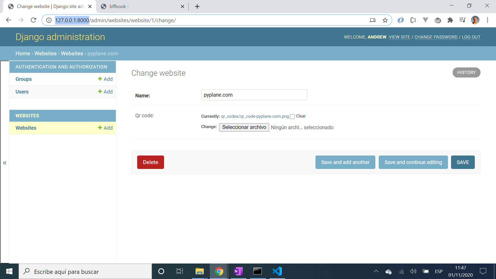

# :zap: Python Django QRCode

* Python-Django app to create QR (Quick Response) codes
* Code from a tutorial by [Pyplane](https://www.youtube.com/channel/UCQtHyVB4O4Nwy1ff5qQnyRw) - see [:clap: Inspiration](#clap-inspiration) below

## :page_facing_up: Table of contents

* [:zap: Python Django QRCode](#zap-python-django-qrcode)
  * [:page_facing_up: Table of contents](#page_facing_up-table-of-contents)
  * [:books: General info](#books-general-info)
  * [:camera: Screenshots](#camera-screenshots)
  * [:signal_strength: Technologies](#signal_strength-technologies)
  * [:floppy_disk: Setup](#floppy_disk-setup)
  * [:computer: Code Examples](#computer-code-examples)
  * [:cool: Features](#cool-features)
  * [:clipboard: Status & To-do list](#clipboard-status--to-do-list)
  * [:clap: Inspiration](#clap-inspiration)
  * [:envelope: Contact](#envelope-contact)

## :books: General info

* Django framework admin dashboard lets user specify website address, although any text entry up to 200 chars will be accepted. This text is converted into a barcode and displayed using the `qrcode` Python library function.
* QR codes saved to a media file on the hard drive - not in the project file.

## :camera: Screenshots




## :signal_strength: Technologies

* [Python v3](https://www.python.org/) programming language
* [Django v3](https://www.djangoproject.com/) server-side web framework
* [qrcode v6](https://pypi.org/project/qrcode/) Pure python QR Code generator

## :floppy_disk: Setup

* [Install Python](https://docs.python-guide.org/starting/installation/)
* [Install pip](https://docs.python-guide.org/dev/virtualenvs/#installing-pipenv)
* [Install Django](https://docs.djangoproject.com/en/3.1/howto/windows/) by typing `pip install Django`
* Run `django-admin startproject qrcode_proj` to create a new project [ref. docs](https://docs.djangoproject.com/en/3.1/intro/tutorial01/)
* Open `qrcode_proj` in VS Code
* Run `python manage.py startapp websites` to create Python module
* Add code
* Run `pip freeze` to see list of modules installed. [Ref. Docs](https://pip.pypa.io/en/stable/reference/pip_freeze/)
* Run `python manage.py makemigrations` for changes to models etc.
* Run `python manage.py migrate` to migrate the migration files.
* To add a superuser run `python manage.py createsuperuser --username=joe --email=joe@example.com` [Ref. Docs](https://docs.djangoproject.com/en/3.1/topics/auth/default/) and log into admin panel
* Run `python manage.py runserver` to run server on port 8000. A refresh is needed after any code changes

## :computer: Code Examples

* extract from `websites/models.py` - saves QR code image with website name as a PNG (Portable Network Graphic) which is the best format to use due to giving a good quality image in a small file size

```python
  def save(self, *args, **kwargs):
    qrcode_img = qrcode.make(self.name)
    canvas = Image.new('RGB', (290, 290), 'white')
    draw = ImageDraw.Draw(canvas)
    canvas.paste(qrcode_img)
    fname = f'qr_code-{self.name}.png'
    buffer = BytesIO()
    canvas.save(buffer, 'PNG')
    self.qr_code.save(fname, File(buffer), save=False)
    canvas.close()
    super().save(*args, **kwargs)
```

## :cool: Features

* Django inbuilt packages - admin dashboard

## :clipboard: Status & To-do list

* Status: Working
* To-do: Nothing

## :clap: Inspiration

* [Pyplane: Youtube: Django QR code tutorial | How to create QR codes in Django](https://www.youtube.com/watch?v=xk8K3MNu81I)

## :envelope: Contact

* Repo created by [ABateman](https://www.andrewbateman.org) - you are welcome to [send me a message](https://andrewbateman.org/contact)
